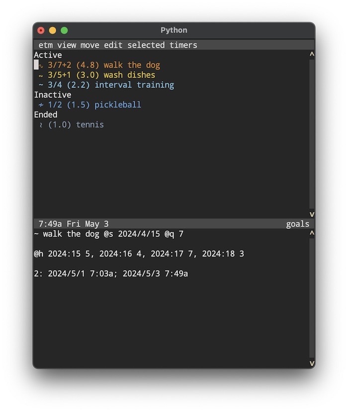

# Weekly Goals

## The Goal Reminder
The goal itemtype (type char `~`) and the corresponding *Goals View* is intended to support pursuing S.M.A.R.T. goals (Specific, Measurable, Achievable, Relevant, Timed) in *etm*. Here is an example of a *goal* as it would be entered:

    ```
        ~ interval training @s 2024/4/22 @q 3
    ```
- It is a *goal* because of the `~` type character. 
- Because I have a custom interval setting on my exercise bike, "interval training" is *specific* and *measurable*. It is also *achievable* and *relevant* for me.
- The `@s` entry is required and times the goal to begin on Monday, April 22, 2024. Whatever date is entered will be automatically converted to the Monday of the corresponding week.
- The `@q` entry is also required and sets to quota for this goal to 3 times per week, repeating indefinitely. Had the quota instead been, say, `@q 3, 5`  then the goal would have been 3 times per week repeated for 5 weeks.
- If this goal were selected in *etm* on, say, Wednesday, April 24 and "F" were pressed, then *etm* would add an `@h 2024:17 1` (history of completions) entry to indicate 1 completion of the goal for the week of *2024:17*. Pressing "F" again in the same week with this goal selected would change this entry to `@h 2024:17 2`.  As one last example, pressing "F" with the goal selected sometime during the week of *2024:18* would leave the recorded entry as

    ```
    ~ interval training @s 2024/4/29 @q 3 @h 2024:17 2, 2024:18 1
    ```

## Goals View

This is a dedicated view *only for goals*. Goals are also displayed in *History View*, *Index View* and so forth, but are **not** displayed in *Agenda View* since goals apply *only to the current week*. 

This view can be selected in *etm* either by pressing "g" or by selecting *goals* from the *view* menu.

Consider this illustrative screenshot from *Goals View*:



Notice first that there is no heading displaying a date or week since *goal view* displays the status in the *current week* of *all* goals. 

In this screen shot "walk the dog" is selected and its details panel is displayed. The leading "3/7+2 (4.8)" in the main window indicates that 3 instances of the goal of 7 have been completed in the current week, that 2 more completions today are needed to get back on schedule for the week and that 4.8 is the current average number of the entire history completions per week for this goal. This history is displayed in the details panel.

In the main window, active goals are sorted by their done/quota ratios and given a color indicating the degree of progress toward completing the goal for the current week based on comparing the done/quota fraction to the fraction of the week that has passed. Since the current weekday, Friday, is the 5th day of the week, the fraction of the week that has passed is somewhere between 4/7 (beginning of Friday) and 5/7 (end of Friday).   
- walk the dog:  colored red because 3/7 is less than 4/7 and thus completions are unambiguously behind schedule for the week - 2 completions today are needed to get back on schedule.
- wash dishes: colored yellow because 3/5 is between 4/7 and 5/7 - 1 completion today is needed to get back on schedule.
- interval training: blue because 3/4 > 5/7 and thus completions are ahead of schedule for this week - no completions are needed today to stay on schedule.

This is a normal view in etm and all the normal commands are available. Additionally, these commands are available when a goal is selected:
- F:  increment the completion count for the current week (by incrementing the count for the current week in @h).
- ^e: end the goal by setting the quota component of `@q` equal to zero. Goals with zero quotas (or goals with quotas specifying a number of weeks that has expired) are regarded as *ended*.
- ^a: toggle the active/inactive status by reversing the sign of the quota component of @q. Goals with negative quotas are regarded as *inactive*. 

A *goal* could, of course, be deleted but this would also delete the history of completions. Ending the goal, on the other hand, preserves the history and places the goal in it's own category at the bottom of the list. And, if you ever want to un-end the goal, just change the zero quota to whatever you like. Similarly, making a goal inactive while you're away on vacation and then making it active again when you return preserves its history and the two key presses required is significantly more convenient than deleting and re-creating the goal.
